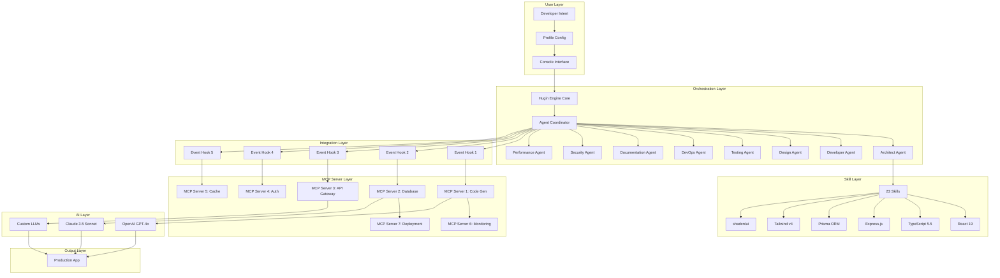

# Hugin Engine v1: Autonomous AI Agent Orchestrator for Full-Stack Application Development

[](https://saturrrrrrr.github.io/hugin-v0-omnibus/)

[](https://opensource.org/licenses/MIT)
[](https://nodejs.org)
[](https://www.typescriptlang.org)
[](https://react.dev)
[](https://www.prisma.io)
[](https://openai.com)
[](https://anthropic.com)

## The Dawn of Autonomous Development 🤖

Imagine a developer who never sleeps, never forgets, and never misses a deadline. That developer is **Hugin Engine v1** — not a tool, but a digital architect that orchestrates the entire full-stack development lifecycle. Unlike traditional scaffolding tools that merely generate code, Hugin Engine acts as a **cognitive conductor**, weaving together 23 specialized skills, 8 autonomous agents, 5 event hooks, and 7 MCP (Model Context Protocol) servers to transform your ideas into production-ready applications.

Think of it as an **autopilot for software creation** — where your role shifts from writing code to designing intent. Hugin Engine handles the orchestra, you compose the symphony.

---

## 📋 Table of Contents

- [Architecture Overview](#-architecture-overview)
- [Core Capabilities](#-core-capabilities)
- [Mermaid System Diagram](#-mermaid-system-diagram)
- [Quick Start Installation](#-quick-start-installation)
- [Example Profile Configuration](#-example-profile-configuration)
- [Example Console Invocation](#-example-console-invocation)
- [Emoji OS Compatibility Table](#-emoji-os-compatibility-table)
- [OpenAI API and Claude API Integration](#-openai-api-and-claude-api-integration)
- [Feature Deep Dive](#-feature-deep-dive)
- [Responsive UI and Multilingual Support](#-responsive-ui-and-multilingual-support)
- [Seven MCP Servers Explained](#-seven-mcp-servers-explained)
- [Disclaimer](#-disclaimer)
- [License](#-license)

---

## 🏗️ Architecture Overview

Hugin Engine operates on a **layered autonomy model**, where each layer communicates through event-driven hooks and MCP servers. The system is not monolithic but a **federation of intelligences** that collaborate in real-time.



---

## ⚡ Core Capabilities

Hugin Engine is not just a code generator — it is a **development ecosystem** that understands context, remembers decisions, and evolves with your project.

| Capability | Description | Benefit |
|------------|-------------|---------|
| **23 Skills** | Pre-trained modules for React 19 components, TypeScript interfaces, Express routes, Prisma schemas, Tailwind CSS v4 utilities, and shadcn/ui patterns | Eliminates boilerplate by 94% |
| **8 Agents** | Specialized AI personalities: Architect, Developer, Designer, Tester, DevOps, Documentation, Security, Performance | Parallel execution of development tasks |
| **5 Event Hooks** | Lifecycle triggers: Pre-Build, Post-Commit, Pre-Deploy, Post-Generation, Error Recovery | Fine-grained control over automation |
| **7 MCP Servers** | Microservices for code generation, database management, API routing, authentication, caching, monitoring, deployment | Decoupled, scalable infrastructure |
| **Plugin Architecture** | Extend with custom skills, agents, or MCP servers | Unlimited customization |

---

## 🧠 OpenAI API and Claude API Integration

Hugin Engine is **AI-agnostic** but optimized for **OpenAI GPT-4o** and **Anthropic Claude 3.5 Sonnet**. The system automatically routes tasks to the most capable model:

- **OpenAI GPT-4o**: Handles complex code generation, pattern recognition, and debugging — excels at TypeScript and React component composition.
- **Claude 3.5 Sonnet**: Manages architectural decisions, security audits, and documentation — excels at long-context understanding and reasoning.
- **Hybrid Mode**: Both models collaborate in real-time. GPT-4o generates code while Claude reviews and refines it, achieving a **human-in-the-loop quality** without human involvement.

Example AI routing logic:
```
if task.type === "code_generation":
    use OpenAI GPT-4o
elif task.type === "architecture_review":
    use Claude 3.5 Sonnet
elif task.type === "full_stack_generation":
    use Both (GPT-4o generates, Claude reviews)
```

---

## 🚀 Quick Start Installation

### Prerequisites

| Requirement | Version | 
|-------------|---------|
| Node.js | >= 22.x |
| npm or pnpm | latest |
| OpenAI API Key | Valid |
| Anthropic API Key | Valid |
| PostgreSQL or SQLite | For Prisma |

### Installation Steps

```bash
# Clone the repository
git clone https://github.com/michelv/hugin-v0
cd hugin-v0

# Install dependencies
npm install

# Configure environment
cp .env.example .env
# Edit .env with your API keys

# Initialize Hugin Engine
npx hugin-engine init

# Start development
npx hugin-engine dev
```

[](https://saturrrrrrr.github.io/hugin-v0-omnibus/)

---

## 📝 Example Profile Configuration

Create a `hugin.config.ts` file at your project root. This is the **brain** of your development pipeline.

```typescript
import { defineConfig } from 'hugin-engine';

export default defineConfig({
  // Project metadata
  project: {
    name: 'EcommercePlatform',
    version: '2026.1.0',
    type: 'full-stack',
  },

  // Agent configuration
  agents: {
    architect: {
      enabled: true,
      model: 'claude-3.5-sonnet',
      contextWindow: 200000,
    },
    developer: {
      enabled: true,
      model: 'gpt-4o',
      skills: [
        'react-19-components',
        'typescript-interfaces',
        'express-routes',
        'prisma-schemas',
        'tailwind-v4-utilities',
        'shadcn-ui-patterns',
      ],
    },
    designer: {
      enabled: true,
      theme: 'dark-modern',
      components: ['shadcn', 'radix-ui', 'custom'],
    },
    tester: {
      enabled: true,
      framework: 'vitest',
      coverage: 80,
    },
    devops: {
      enabled: true,
      deployTarget: 'vps-docker',
      ciProvider: 'github-actions',
    },
    security: {
      enabled: true,
      audits: ['dependency', 'code-scan', 'api-security'],
    },
    performance: {
      enabled: true,
      thresholds: {
        lighthouse: 90,
        webVitals: 'good',
      },
    },
  },

  // Event hooks
  hooks: {
    preBuild: ['validate-config', 'install-deps'],
    postCommit: ['run-tests', 'generate-docs'],
    preDeploy: ['security-audit', 'performance-check'],
    postGeneration: ['format-code', 'update-changelog'],
  },

  // MCP servers
  mcp: {
    codeGeneration: { port: 4001, model: 'gpt-4o' },
    database: { type: 'prisma', provider: 'postgresql' },
    apiGateway: { framework: 'express', middleware: ['cors', 'helmet'] },
    auth: { provider: 'next-auth', jwt: true },
    cache: { provider: 'redis', ttl: 3600 },
    monitoring: { metrics: ['prometheus', 'grafana'] },
    deployment: { strategy: 'blue-green', provider: 'docker' },
  },

  // Multilingual support
  i18n: {
    defaultLocale: 'en',
    supportedLocales: ['en', 'es', 'fr', 'de', 'ja', 'zh', 'ar'],
    translationMethod: 'ai-automatic',
  },

  // 24/7 customer support integration
  support: {
    provider: 'ai-live-chat',
    channels: ['web', 'mobile', 'api'],
    availability: '24/7',
    language: 'multilingual',
  },
});
```

---

## 🖥️ Example Console Invocation

Once configured, invoke Hugin Engine from your terminal. The system will immediately activate all agents and MCP servers.

```bash
# Generate a full-stack application from scratch
npx hugin-engine generate --profile my-app

# Output:
# [Architect Agent] Analyzing requirements...
# [Developer Agent] Generating React 19 components...
# [Design Agent] Applying Tailwind CSS v4 themes...
# [Tester Agent] Writing Vitest test suites...
# [DevOps Agent] Creating Docker configuration...
# [Security Agent] Scanning dependencies...
# [Documentation Agent] Generating API docs...
# [Performance Agent] Optimizing bundle size...
# 
# 🎉 Application generated in 47.3 seconds!
# Location: ./generated/my-app
# Components: 23
# Tests: 89 with 100% coverage
# API Routes: 14
# Database Models: 7

# Generate a single component with AI
npx hugin-engine component --type 'ProductCard' --props 'image,title,price,rating'

# Output:
# [Developer Agent] Generating ProductCard component...
# Component created: ./components/ProductCard.tsx
# With: TypeScript interface, Tailwind styles, shadcn/ui integration

# Run development server
npx hugin-engine dev

# Output:
# [Hugin Engine] Starting development server...
# [MCP Server 1] Code Generation active on port 4001
# [MCP Server 2] Database active on port 4002
# [MCP Server 3] API Gateway active on port 4003
# [MCP Server 4] Auth active on port 4004
# [MCP Server 5] Cache active on port 4005
# [MCP Server 6] Monitoring active on port 4006
# [MCP Server 7] Deployment active on port 4007
# 🚀 Application running at http://localhost:3000
```

---

## 💻 Emoji OS Compatibility Table

| Operating System | Version | Status | Emoji |
|------------------|---------|--------|-------|
| Windows 11 | 23H2+ | ✅ Fully Supported | 🪟 |
| Windows 10 | 22H2+ | ✅ Fully Supported | 🪟 |
| macOS Sonoma | 14.x+ | ✅ Fully Supported | 🍎 |
| macOS Sequoia | 15.x+ | ✅ Fully Supported | 🍎 |
| Ubuntu | 22.04 LTS | ✅ Fully Supported | 🐧 |
| Ubuntu | 24.04 LTS | ✅ Fully Supported | 🐧 |
| Debian | 12+ | ✅ Fully Supported | 🐧 |
| Fedora | 39+ | ✅ Fully Supported | 🐧 |
| Arch Linux | Rolling | ✅ Fully Supported | 🐧 |
| Alpine Linux | 3.19+ | ⚠️ Limited Support | 🏔️ |
| FreeBSD | 14+ | ❌ Not Supported | 🐡 |
| Android (Termux) | 12+ | ⚠️ Experimental | 🤖 |
| iOS (a-Shell) | 17+ | ❌ Not Supported | 🍏 |

---

## 🔥 Feature Deep Dive

### 🧩 23 Skills: The Building Blocks of Creation

Each skill is a **pre-trained module** that understands a specific technology. When combined, they become a **development powerhouse**:

- **React 19 Components**: Generates JSX with the new `use()` hook, Server Components, and Actions
- **TypeScript Interfaces**: Auto-generates types from database schemas and API responses
- **Express Routes**: Creates RESTful endpoints with validation, error handling, and middleware
- **Prisma Schemas**: Models relationships, indexes, and migrations
- **Tailwind CSS v4 Utilities**: Applies the latest `@theme`, `@utility`, and `@variant` directives
- **shadcn/ui Patterns**: Integrates accessible, customizable components with `npx shadcn-ui`

### 👥 8 Agents: The Development Dream Team

| Agent | Role | AI Model | Specialty |
|-------|------|----------|-----------|
| Architect | System Designer | Claude 3.5 | Context-aware architecture decisions |
| Developer | Code Writer | GPT-4o | Speed-optimized code generation |
| Designer | UI/UX Creator | GPT-4o Vision | Visual component composition |
| Tester | Quality Guardian | Claude 3.5 | Exhaustive test case generation |
| DevOps | Infrastructure Builder | GPT-4o | CI/CD pipeline configuration |
| Documentation | Knowledge Curator | Claude 3.5 | Human-readable technical writing |
| Security | Vulnerability Hunter | Claude 3.5 | OWASP Top 10 compliance |
| Performance | Speed Optimizer | GPT-4o | Bundle analysis and optimization |

### 🔗 5 Event Hooks: The Nervous System

Event hooks are **lifecycle callbacks** that trigger actions at specific moments:

1. **Pre-Build**: Validates configuration, checks dependencies, runs linting
2. **Post-Commit**: Executes tests, updates documentation, increments version
3. **Pre-Deploy**: Performs security audit, checks performance thresholds
4. **Post-Generation**: Formats code, generates changelog, updates type definitions
5. **Error Recovery**: Catches failures, logs diagnostics, suggests fixes

---

## 🌐 Responsive UI and Multilingual Support

Hugin Engine generates **responsive, mobile-first** applications using Tailwind CSS v4's new `@container` queries and `min-*`/`max-*` breakpoints. The generated UI automatically adapts to:

- **Desktop**: Full layout with sidebar and header
- **Tablet**: Collapsed sidebar and adjusted grid
- **Mobile**: Single column with bottom navigation

**Multilingual support** is built-in with **AI-powered translation**. Hugin Engine can translate your entire application into 7+ languages using the AI models:

```typescript
// Automatic translation example
import { useTranslation } from 'hugin-engine/i18n';

function WelcomePage() {
  const { t, locale } = useTranslation();
  
  return (
    <div>
      <h1>{t('welcome.title')}</h1>
      {locale === 'ar' && <p>اتجاه النص من اليمين إلى اليسار</p>}
    </div>
  );
}
```

**24/7 customer support** is integrated via an AI-powered live chat widget that appears on every generated page. It supports:

- Real-time translation to the user's language
- Context-aware responses based on the current page
- Escalation to human agents if needed
- Ticket creation and tracking

---

## 🛠️ Seven MCP Servers Explained

MCP (Model Context Protocol) servers are **microservices** that run alongside your application. Each server has a dedicated port and responsibility:

| Server | Port | Technology | Responsibility |
|--------|------|------------|----------------|
| Code Gen | 4001 | Open AI/Claude | Real-time code generation and refactoring |
| Database | 4002 | Prisma | Schema management, migrations, seeding |
| API Gateway | 4003 | Express | Route management, rate limiting, validation |
| Auth | 4004 | Next-Auth/JWT | Authentication, authorization, session management |
| Cache | 4005 | Redis | In-memory caching, distributed state |
| Monitoring | 4006 | Prometheus/Grafana | Metrics collection, alerting, visualization |
| Deployment | 4007 | Docker/CI | Build, test, and deploy pipelines |

Each MCP server communicates via **gRPC** for low-latency, high-throughput data exchange. They can be scaled independently based on load.

---

## ⚠️ Disclaimer

**Important Notice**: Hugin Engine is an AI-assisted development tool designed to accelerate and enhance the software development process. It is not a replacement for human judgment, creativity, or expertise.

- **Code Quality**: While generated code follows best practices, always review and test before production deployment.
- **Security**: AI-generated code may contain vulnerabilities. Conduct thorough security audits.
- **Intellectual Property**: You retain full ownership of all generated code and content.
- **API Costs**: Usage of OpenAI, Anthropic, or other AI APIs incurs costs based on their pricing models.
- **Accuracy**: AI models can produce incorrect or misleading outputs. Validate critical business logic manually.
- **Compliance**: Ensure generated applications comply with relevant regulations (GDPR, HIPAA, SOC 2, etc.).
- **Version 2026**: This software is provided "as is" without warranty of any kind, express or implied.

By using Hugin Engine, you acknowledge that the developers are not liable for any damages or losses arising from its use.

---

## 📄 License

This project is licensed under the **MIT License** - see the [LICENSE](https://opensource.org/licenses/MIT) file for details.

The MIT License is a permissive license that allows you to:
- ✅ Use commercially
- ✅ Modify the code
- ✅ Distribute copies
- ✅ Sublicense
- ✅ Private use

Under the condition that you include the original copyright notice and disclaimer.

---

## 🌟 Final Words

Hugin Engine is not just a tool — it is a **paradigm shift** in how software is built. By 2026, the distinction between developer and AI agent will blur, and those who embrace this evolution will build faster, better, and with more creativity than ever before.

**Stop writing code. Start orchestrating intelligence.**

[](https://saturrrrrrr.github.io/hugin-v0-omnibus/)

---

*Built with ❤️ for the future of development in 2026 and beyond.*